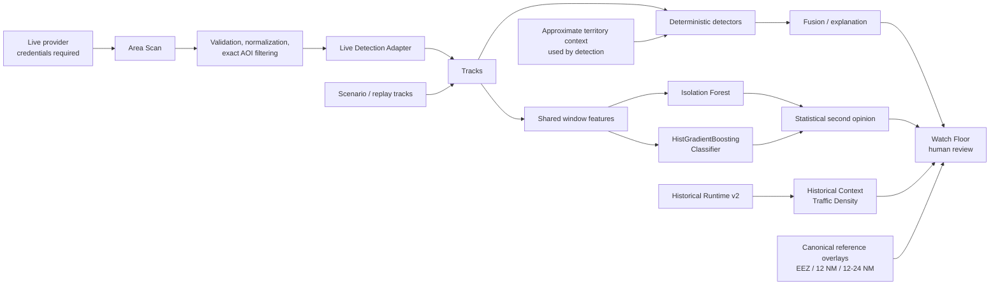

# SeaWatch

Explainable maritime anomaly review combining deterministic behavior detection,
machine-learning second opinions, historical traffic context, geospatial
reference layers, and human analyst review.

## Overview

SeaWatch is a maritime situational-awareness prototype for reviewing vessel
behavior with evidence and context. When provider credentials are enabled, it
can acquire a live maritime picture through a protected Area Scan workflow. It
also combines historical vessel-presence context, maritime reference geography,
deterministic behavior rules, alert fusion, and optional model-based second
opinions in an analyst-facing Watch Floor.

SeaWatch is decision support, not an autonomous enforcement system. Alerts are
candidates for human review; they are not findings of hostile intent,
illegality, or authorization status.

## Try the Demo

### Detection / Watch Floor Demo

**[Launch the interactive Detection Demo](https://seawatch-demo.vercel.app/?clean=1)**

Explore the scenario/replay Watch Floor, explainable alerts, analyst decisions,
and optional machine-learning second-opinion evidence. This standalone demo does
not require the currently disabled paid live-data provider. ML evidence appears
only when the demo has compatible model artifacts available.

### Integrated Public Frontend

**[Open the integrated SeaWatch frontend](https://seawatch-web.vercel.app/)**

Explore the final live/historical integration architecture. Paid
provider-backed scans may be unavailable, and the optional Historical Runtime
bundle may not be mounted in the public deployment. Neither deployment has
guaranteed uptime.

## Key Features

### Live maritime picture

- Provider-backed Area Scan architecture with polygon and rectangle areas of
  interest.
- Deterministic provider query planning followed by exact WGS84 geometry
  filtering.
- Provider readiness, health, recovery, request-budget, and graceful-degradation
  handling.
- Normalized vessel categories and map visualization.
- Same-origin Vercel rewrites keep browser API requests on the public frontend
  origin.
- Provider credentials and raw provider identities remain server-side.
- Canonical Area Scan-to-Live Detection hook with a rolling live track buffer.

### Explainable detection

- Deterministic review signals for AIS gaps, loitering, rendezvous and
  clustering, zone entry, position jumps, identity conflicts, status mismatch,
  route deviation, and survey-pattern-related behavior.
- Risk fusion with an explainable factor breakdown, evidence, uncertainty,
  benign alternatives, and recommended analyst actions.
- Optional statistical or machine-learning second opinions when a compatible
  regional model is available. No model score is invented when a model is
  absent.
- Human review workflow for status decisions, notes, allow-list feedback, and
  path-review decisions.
- Scenario and Live operating modes in the Watch Floor.

### Machine-learning second opinion

SeaWatch implements two advisory models over the same vessel behavior-window
feature pipeline:

- **Isolation Forest** provides unsupervised anomaly detection. It asks whether
  a behavior window differs from learned normal traffic, then calibrates the raw
  anomaly score as a percentile against training or reference windows.
- **`HistGradientBoostingClassifier`** is a supervised behavior classifier. It
  produces a behavior-match score indicating how closely a window resembles the
  labelled target behaviors represented in its training data.

The model-training and benchmark workflow evaluates both methods on held-out
prototype scenarios rather than the scenarios used for fitting. In the running
application, deterministic rules create and explain alerts; compatible regional
model artifacts can add an `agree` or `rules_only` statistical second opinion,
model scores, and the strongest feature deviations for analyst review. ML does
not replace the rules, create an autonomous threat verdict, or estimate criminal
intent.

If a compatible model artifact is absent—or background window scoring has not
completed—the application does not fabricate a model result. ML evidence is not
available for every region, scenario, live vessel, or deployment, and all model
output remains advisory and subject to human review.

### Historical context

- Historical Runtime v2 summary and Historical Context card.
- Historical Traffic Density visualization across 2,457 coarse traffic cells.
- The source runtime contains 33,209,747 standardized hourly vessel-presence
  observations representing 400,821 historical vessel IDs.
- Conservative cross-source identity policy: only unambiguous, valid
  dataset-internal identity candidates are eligible for matching.
- Optional local runtime bundle; the application remains usable when it is not
  installed.

> Historical Runtime data is standardized hourly vessel presence, not raw or
> message-level AIS. The approximately 0.1-degree cells are contextual summaries,
> not precise vessel positions or reconstructed live trajectories.

### Maritime reference context

- EEZ reference areas.
- Derived 12 NM territorial-sea reference polygons.
- Derived 12-24 NM contiguous-zone reference bands.
- Source provenance and overlapping claims are preserved without selecting a
  legally preferred claimant.

These layers are neutral reference context only. They are not for navigation,
sovereignty determinations, or legal adjudication.

### Resilience extension

- Deterministic, explainable disruption-scenario and logistics simulation.
- Offline-capable demonstration paths with explicit provenance labels.
- Synthetic planning values and recommendations remain subject to human review.

## Architecture



Historical hourly presence supplies coarse context; it does not create raw live
tracks. The live provider path and the historical context path remain separate
until they are presented to detection and analyst-review surfaces. Canonical
maritime reference overlays are map context; detection uses its separately
documented approximate territory context. The deterministic path remains the
alerting path; the parallel ML branch is an optional second opinion when
compatible artifacts are available.

## Demo / Service Status

### Detection / Watch Floor Demo

[seawatch-demo.vercel.app/?clean=1](https://seawatch-demo.vercel.app/?clean=1)
provides the scenario/replay detection, explanation, human-review, and optional
model-second-opinion experience. The standalone Watch Floor demo remains useful
when paid live provider access is disabled because it does not depend on that
provider. Model evidence is shown only when compatible artifacts are available.

### Integrated Public Frontend

[seawatch-web.vercel.app](https://seawatch-web.vercel.app/) presents the final
live/historical integration architecture. Paid provider-backed scans may be
unavailable, and the optional Historical Runtime bundle may not be mounted
publicly. Public uptime is not guaranteed.

> Public demo note: live provider-backed vessel scans may be unavailable because
> the paid API subscription is currently disabled. Historical Runtime features
> are available when the optional runtime bundle is configured locally; the
> public deployment may not include that bundle. The integration logic remains
> implemented in the repository.

### Code status

The provider adapter, Area Scan planning and validation, access controls, live
detection hook, Watch Floor behavior, historical runtime integration, and map
layers are implemented and preserved in this repository.

### Live external provider

**Live provider status:** The paid live vessel-data API used during development
has been disabled after the hackathon to avoid ongoing API charges. The provider
integration and detection pipeline remain implemented in the repository and can
be re-enabled with valid credentials.

Datalastic live API access is therefore currently disabled due to subscription
cost. This is an operational cost decision, not removal or failure of the
integration. The public deployment must not be assumed to serve paid live
provider data.

### Historical Runtime

Historical Runtime v2 is an optional local bundle and is not checked into Git.
When it is absent, the API and interface report the unavailable state while the
remaining local, scenario, detection, and map functionality continues to work.

## Quick Start

Prerequisites: Python, Node.js, and npm versions compatible with the pinned
project dependencies.

From the repository root in PowerShell:

```powershell
python -m venv .venv
.\.venv\Scripts\Activate.ps1
python -m pip install --upgrade pip
python -m pip install -r requirements.txt

Set-Location apps\web
npm ci
Set-Location ..\..
```

Start the backend from the repository root:

```powershell
.\.venv\Scripts\Activate.ps1
python -m uvicorn apps.api.seawatch.main:app --host 127.0.0.1 --port 8000
```

In a second terminal, start the frontend:

```powershell
Set-Location apps\web
npm run dev
```

Open `http://localhost:5173`. API documentation is available at
`http://127.0.0.1:8000/docs`.

### Optional historical context

Point SeaWatch at an extracted Historical Runtime v2 bundle:

```powershell
$env:SEAWATCH_HISTORICAL_RUNTIME = "C:\path\to\SeaWatch_Runtime_Taiwan_2026_v2"
```

That path is only a generic Windows example. The bundle may live anywhere, is
optional, and must not be committed to this repository.

### Optional paid live provider

To re-enable the implemented Datalastic provider adapter, supply a valid
server-side credential before starting the backend:

```powershell
$env:DATALASTIC_API_KEY = "<your valid credential>"
```

`DATALASTIC_API_KEY` enables the provider adapter; authenticated Area Scan
requests remain fail-closed until the existing server-side access controls are
also configured. A local-only scan session requires a signing secret of at
least 32 bytes plus loopback auto-auth:

```powershell
$env:SEAWATCH_AREA_SCAN_SIGNING_KEY = "<at least 32 random bytes>"
$env:SEAWATCH_AREA_SCAN_AUTOAUTH_LOOPBACK = "true"
```

Loopback auto-auth is for local development only. Controlled deployments use
the existing `SEAWATCH_AREA_SCAN_OPERATOR_KEY` instead; see the
[demo readiness runbook](docs/demo-readiness-runbook.md). The repository does
not contain these credentials. Never expose a key to the browser, print it in
logs, or commit it.

## Data, Provenance, and Limitations

- Historical Runtime v2 contains standardized hourly vessel presence, not raw
  AIS messages. Its approximately 0.1-degree grid cannot support message-level
  trajectory claims.
- Historical Traffic Density is analyst context, not a threat, risk, or
  suspicious-activity map.
- AIS and provider identity fields are self-reported or externally supplied and
  may be incomplete, stale, duplicated, or incorrect.
- Missing AIS can result from coverage, equipment, transmission, or processing
  conditions; it does not by itself prove suspicious behavior.
- Alerts are prioritized human-review candidates, not determinations of intent,
  identity, legality, or guilt.
- Maritime boundaries and derived zones are reference-only and are not suitable
  for navigation, sovereignty decisions, or legal adjudication.
- Provider-backed live behavior depends on valid external credentials and
  provider availability.
- Optional model results depend on compatible local artifacts and regional
  validation. Core rule-based detection does not require an ML model.

See [data provenance](docs/data-provenance.md), the
[Taiwan historical-data notes](docs/taiwan-real-data.md), and the
[maritime reference dataset documentation](data/gis/taiwan_maritime_reference/README.md)
for source-specific details and licenses.

## Privacy and Security

- Provider credentials, raw MMSI values, and provider-specific identities remain
  backend-only on the live integration path.
- Browser responses use public vessel identifiers generated by the backend.
- Historical/live identity joins use a conservative policy; shared, malformed,
  or ambiguous identities are rejected rather than guessed.
- The integration does not fabricate MMSIs when a source identity is missing.
- Area Scan uses short-lived signed capabilities, protected operator sessions,
  bounded request bodies, secure cookie defaults, and fail-closed configuration.
- Provider requests are bounded by scan-size, vessel-count, concurrency,
  caching, and shared request/rate-limit controls.

Secret values are never part of the public status or frontend payloads.

## Development and Testing

Backend and frontend test suites cover live adapters, Area Scan, historical
runtime behavior, map layers, detection logic, and analyst-facing components.

```powershell
python -m pytest

Set-Location apps\web
npm test
npm run build
```

The project intentionally avoids permanent test-count badges; counts change as
the prototype evolves.

## Repository Structure

```text
apps/api/      FastAPI services, provider adapters, detection, and runtimes
apps/web/      React, TypeScript, MapLibre, and Watch Floor UI
data/gis/      Versioned maritime reference layers and provenance
docs/          Architecture, runbooks, validation reports, and source notes
scripts/       Data preparation, evaluation, training, and demo utilities
tests/         Backend unit and integration tests
```

Large raw datasets, generated models, local caches, and the optional Historical
Runtime bundle are not repository artifacts.

## Further Documentation

- [Integration guide](docs/INTEGRATION.md)
- [Area Scan and Live Detection hook](docs/area-scan-detection-hook.md)
- [Live Detection Adapter](docs/live-detection-adapter.md)
- [Detection stack](docs/detection-stack.md)
- [Demo readiness runbook](docs/demo-readiness-runbook.md)
- [Edge AIS operations](docs/edge-ais-runbook.md)
- [Resilience logistics runbook](docs/phase9-resilience-logistics-runbook.md)

## Project Principles

- Explainability over black-box conclusions.
- Human review over autonomous judgment.
- Reproducible provenance over hidden data transformations.
- Decision support over claims of hostile intent or illegality.
